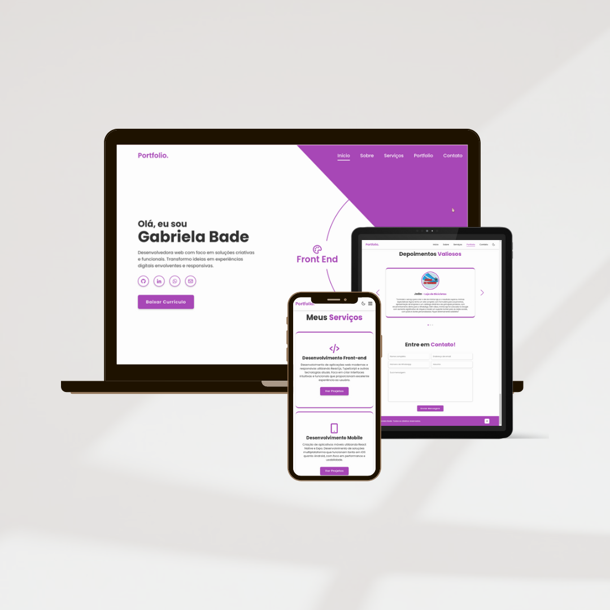
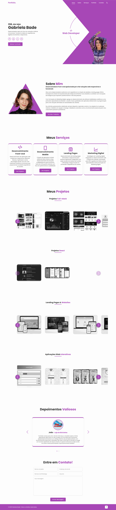

# Portfólio - Gabriela Bade

Este é o meu portfólio pessoal desenvolvido com **HTML, CSS e JavaScript**. Ele foi criado para apresentar meus projetos, habilidades e oferecer um meio de contato para recrutadores.

---

## Funcionalidades

✔ Design responsivo para desktop e mobile
 
✔ Modo claro/escuro
 
✔ Carrossel interativo de projetos
 
✔ Formulário de contato integrado ao WhatsApp
 
✔ Efeitos de animação ao rolar a página

---

## Acesse o Portfólio

➡ [Clique aqui para visualizar meu portfólio](https://gabriela-bade.netlify.app/)

---
## Pré-visualização

## Contato
E-mail: [gabriela.bade@hotmail.com](mailto:gabriela.bade@hotmail.com)

WhatsApp: [Clique para enviar mensagem](https://wa.me/5548991056014)

LinkedIn: [gabriela-bade](https://linkedin.com/in/gabriela-bade)

GitHub: [gabrielabade](https://github.com/gabrielabade)

---

---

